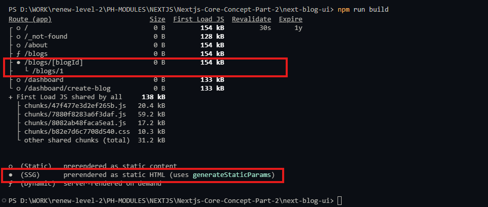

## Next Js Core Concept Part-2 
Server GitHub Repo Link:

https://github.com/Apollo-Level2-Web-Dev/next-blog-server


Frontend GitHub Repo Link:

https://github.com/Apollo-Level2-Web-Dev/next-blog-ui

## 53-1 Initial project setup and configure external server
- install Shadcn 

```
bunx --bun shadcn@latest init

```

```
bunx --bun shadcn@latest add button
```

## 53-2 Caching and revalidating the latest blogs on the homepage
- set the env.local 
- for this we must have to follow the conversion `NEXT_PUBLIC_BASE_API=`
- Remember for fetching the component must be a server component and async must be used. 
- Using ISR for home page blogs 

```tsx
/* eslint-disable @typescript-eslint/no-explicit-any */
import BlogCard from "@/components/modules/Blogs/BlogCard";
import Hero from "@/components/modules/Home/Hero";

export default async function HomePage() {
  const res = await fetch(`${process.env.NEXT_PUBLIC_BASE_API}/post`)
  const { data: blogs } = await res.json()

  return (
    <div>
      <Hero />
      <h2 className="text-center my-5 text-4xl">Featured Posts</h2>
      <div className=" grid grid-cols-3 gap-4 ">
        {blogs.map((blog: any) => (
          <BlogCard key={blog.id} post={blog} />
        ))}

      </div>
    </div>
  );
}

```

## 53-3 Show off all the fantastic blogs using SSR

- using SSR for blogs page 

```tsx 
/* eslint-disable @typescript-eslint/no-explicit-any */
import BlogCard from "@/components/modules/Blogs/BlogCard";

const AllBlogsPage = async () => {
  const res = await fetch(`${process.env.NEXT_PUBLIC_BASE_API}/post`, {
    cache : "no-store"
  })
  const { data: blogs } = await res.json()
  return (
    <div className="py-30 px-4 max-w-7xl mx-auto">
      <h2 className="text-center text-4xl">All Blogs</h2>
      <div className=" grid grid-cols-3 gap-4 max-w-6xl mx-auto my-6">
        {blogs.map((blog: any) => (
          <BlogCard key={blog.id} post={blog} />
        ))}

      </div>
    </div>
  );
};

export default AllBlogsPage;

```

## 53-4 Retrieve dynamic data with an ID for the detail page using SSR
```tsx 
import BlogDetailsCard from "@/components/modules/Blogs/BlogDetailsCard";

const BlogDetailsPage = async ({ params }: { params: Promise<{ blogId: string }> }) => {
    const { blogId } = await params;
    const res = await fetch(`${process.env.NEXT_PUBLIC_BASE_API}/post/${blogId})

    const blog  = await res.json()
    return (
        <div className="py-30 px-4 max-w-7xl mx-auto">
            <h1>Blog Details Page</h1>
            <BlogDetailsCard blog={blog} />
        </div>
    );
};

export default BlogDetailsPage;
```
- by default a component is doing server site rendering. so loading state will appear here even if its not mentioned 
- This is because of reducing load on server.
- Instead of doing this we can do something like top most visited 10/20 posts contents will be generated statically in build time instead of on-demand request this will smoothen the user experience. we will use `generateStaticParams()`. 


## 53-5 Fetch dynamic data using generateStaticParams() for SSG
- The generateStaticParams function can be used in combination with dynamic route segments to statically generate routes at build time instead of on-demand at request time.

```tsx 
import BlogDetailsCard from "@/components/modules/Blogs/BlogDetailsCard";

export const generateStaticParams = async () => {
    return [
        {
            blogId: "1"
        }
    ]
}

const BlogDetailsPage = async ({ params }: { params: Promise<{ blogId: string }> }) => {
    const { blogId } = await params;
    const res = await fetch(`${process.env.NEXT_PUBLIC_BASE_API}/post/${blogId}`)

    const blog = await res.json()
    return (
        <div className="py-30 px-4 max-w-7xl mx-auto">
            <h1>Blog Details Page</h1>
            <BlogDetailsCard blog={blog} />
        </div>
    );
};

export default BlogDetailsPage;
```



- now grab the most visited post id dynamically. 

```tsx 
/* eslint-disable @typescript-eslint/no-explicit-any */
import BlogDetailsCard from "@/components/modules/Blogs/BlogDetailsCard";

export const generateStaticParams = async () => {
    const res = await fetch(`${process.env.NEXT_PUBLIC_BASE_API}/post`)

    const { data: blogs } = await res.json()

    return blogs.slice(0,2).map((blog: any) => ({
        blogId: String(blog.id)
    }))
}

const BlogDetailsPage = async ({ params }: { params: Promise<{ blogId: string }> }) => {
    const { blogId } = await params;
    const res = await fetch(`${process.env.NEXT_PUBLIC_BASE_API}/post/${blogId}`)

    const blog = await res.json()
    return (
        <div className="py-30 px-4 max-w-7xl mx-auto">
            <h1>Blog Details Page</h1>
            <BlogDetailsCard blog={blog} />
        </div>
    );
};

export default BlogDetailsPage;
```

## 53-6 Generating Dynamic Metadata with generateMetadata()

```tsx 
/* eslint-disable @typescript-eslint/no-explicit-any */
import BlogCard from "@/components/modules/Blogs/BlogCard";
import { Metadata } from "next";

export const metadata : Metadata = {
  title: "All Blogs | Next Blog",
  description : "This is a page which is seo Friendly"
}
const AllBlogsPage = async () => {
  const res = await fetch(`${process.env.NEXT_PUBLIC_BASE_API}/post`, {
    cache : "no-store"
  })
  const { data: blogs } = await res.json()
  return (
    <div className="py-30 px-4 max-w-7xl mx-auto">
      <h2 className="text-center text-4xl">All Blogs</h2>
      <div className=" grid grid-cols-3 gap-4 max-w-6xl mx-auto my-6">
        {blogs.map((blog: any) => (
          <BlogCard key={blog.id} post={blog} />
        ))}

      </div>
    </div>
  );
};

export default AllBlogsPage;

```
- This is a basic seo works. we can add keyword, og image. 

- Now lets see how we can add dynamic page dynamic meta data. we have to use it `generateMetadata`

```tsx
/* eslint-disable @typescript-eslint/no-explicit-any */
import BlogDetailsCard from "@/components/modules/Blogs/BlogDetailsCard";

export const generateStaticParams = async () => {
    const res = await fetch(`${process.env.NEXT_PUBLIC_BASE_API}/post`)

    const { data: blogs } = await res.json()

    return blogs.slice(0, 2).map((blog: any) => ({
        blogId: String(blog.id)
    }))
}

export const generateMetadata = async ({ params }
    : { params: Promise<{ blogId: string }> }
) => {
    const { blogId } = await params;
    const res = await fetch(`${process.env.NEXT_PUBLIC_BASE_API}/post/${blogId}`)
    const blog = await res.json()

    return {
        title : blog?.title,
        description :blog?.content
    }
}

const BlogDetailsPage = async ({ params }: { params: Promise<{ blogId: string }> }) => {
    const { blogId } = await params;
    const res = await fetch(`${process.env.NEXT_PUBLIC_BASE_API}/post/${blogId}`)

    const blog = await res.json()
    return (
        <div className="py-30 px-4 max-w-7xl mx-auto">
            <h1>Blog Details Page</h1>
            <BlogDetailsCard blog={blog} />
        </div>
    );
};

export default BlogDetailsPage;
```

